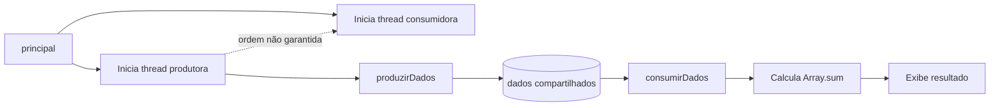

# Relatório sobre implementação de comunicação entre tarefas em F#

## Introdução

Este relato faz parte do processo avaliativo da disciplina de sistemas operacionas no curso superior em análise e desenvolvimento de sistemas, ofertado na Diretoria acadêmica de gestão e tecnologia da informação no campus natal-central do instituto federal de educação, ciência e tecnologia do rio grande do norte.

Tem como objetivo principal relatar as implementações de comunicação entre tarefas na linguagem F#.

O grupo de trabalho foi formado por Arthus Santos, Bruno Ítalo e João Ricardo.

## Resumo

Foram traduzidos para F# três exemplos originalmente escritos em Python: execução sequencial, compartilhamento de dados entre duas threads e importação de um módulo. O `Dockerfile` usa o SDK 8.0 do .NET para padronizar a execução. O exemplo de threads mantém a condição de corrida do código original, enquanto os exemplos de comunicação entre processos e entre computadores não estavam presentes na base fornecida.

## Diagrama do produtor-consumidor



## Comunicação entre tarefas em F#

### Informações gerais

Comunicação entre tarefas permite que partes de um programa troquem dados e coordenem sua execução. Essa comunicação é necessária quando se deseja dividir o trabalho entre threads ou processos, melhorar o aproveitamento do processador e organizar programas concorrentes. Também é preciso controlar a ordem de acesso aos dados compartilhados para evitar condições de corrida.

O Docker foi escolhido porque fornece um ambiente reproduzível para a execução dos códigos. Assim, a versão do SDK, as bibliotecas e o sistema usado para executar o F# ficam padronizados, independentemente da configuração do computador de cada integrante.

O arquivo `Dockerfile` usa a imagem oficial `mcr.microsoft.com/dotnet/sdk:8.0`, define `/app` como diretório de trabalho, copia os scripts de `src/F#` e configura `dotnet fsi` como ponto de entrada. O comando padrão executa `sequencial.fsx`, mas qualquer um dos scripts pode ser informado ao iniciar o contêiner.

Para construir a imagem e executar os exemplos, use os comandos a partir da raiz do repositório:

```powershell
docker build -t ativ3-fsharp .
docker run --rm ativ3-fsharp sequencial.fsx --run
docker run --rm ativ3-fsharp produtor_consumidor.fsx --run
docker run --rm ativ3-fsharp exemplo_main.fsx
```

### Comunicação entre tarefas com linhas de execução no mesmo processo

O arquivo `produtor-consumidor.fsx` é a tradução de `produtor-consumidor.py`. A variável `dados` é compartilhada pelas duas threads. A thread produtora gera 100 números aleatórios entre 0 e 110 e grava a lista; a thread consumidora lê a lista e calcula sua soma. `Thread.Start()` inicia as duas linhas de execução.

Esta tradução mantém o comportamento do Python original, inclusive a ausência de `Join`, mutex ou evento de sincronização. Portanto, a thread consumidora pode começar antes de a produtora preencher `dados`, o que caracteriza uma condição de corrida. Uma versão de produção deveria usar uma sincronização, como `AutoResetEvent`, ou uma fila concorrente.

Código completo:

```fsharp
open System
open System.Threading

let gerador = Random()
let mutable dados: int array = [||]

let produzirDados () =
	printfn "# produzir - iniciado"
	dados <- Array.init 100 (fun _ -> gerador.Next(0, 111))
	printfn "# produzir %A" dados
	printfn "# produzir - terminado"
	dados

let consumirDados () =
	printfn "### consumir - iniciado"
	printfn "### dados -> %A" dados
	let resultado = Array.sum dados
	printfn "### resultado -> %d" resultado
	printfn "### consumir - terminado"

let principal () =
	printfn "iniciou"
	let threadProdutor = Thread(ThreadStart(fun () -> produzirDados () |> ignore))
	let threadConsumidor = Thread(ThreadStart(consumirDados))
	threadProdutor.Start()
	threadConsumidor.Start()
	printfn "finalizou"

if fsi.CommandLineArgs |> Array.contains "--run" then
	principal ()
```

Os comandos de construção e execução estão na seção de informações gerais. No ambiente utilizado, o executável `docker` estava instalado, mas o Docker Desktop não estava com o daemon Linux ativo. Por isso, a construção retornou `failed to connect to the docker API`. A saída de referência do Python foi:

```text
iniciou
# produzir - iniciado
### consumir - iniciado
### dados -> [lista de 100 números]
### resultado -> 5577
### consumir - terminado
finalizou
```

Os números e a soma mudam a cada execução. A ordem das mensagens das threads também pode mudar.

O problema encontrado foi a indisponibilidade do daemon do Docker. A solução é iniciar o Docker Desktop antes de executar os comandos. Também foi identificado o problema de sincronização herdado do código Python; ele deve ser corrigido com um mecanismo de coordenação entre produtor e consumidor quando for necessário garantir uma execução determinística.

### Comunicação entre tarefas em processos diferentes no mesmo computador

Os arquivos Python fornecidos não implementam comunicação entre processos diferentes. `sequencial.py` executa tudo no mesmo processo, `produtor-consumidor.py` usa threads do mesmo processo e `exemplo_main.py` apenas importa um módulo. Consequentemente, não foi possível fazer uma tradução F# dessa categoria sem criar um exemplo novo que não existia na base de comparação.

Para implementar esta etapa, seria necessário usar um mecanismo de IPC, como pipes nomeados, sockets locais, memória compartilhada ou arquivos coordenados. O processo produtor e o processo consumidor também precisariam ser iniciados separadamente.

Não houve execução nem saída de terminal para esta categoria, pois não existe código correspondente nos arquivos Python originais.

O ponto pendente é a ausência de uma especificação de protocolo IPC no material fornecido. Para concluir esta etapa, seria necessário definir o formato das mensagens, quem inicia a comunicação e como os processos encerram a conexão.

### Comunicação entre tarefas em processos diferentes em computadores diferentes

Essa categoria também não está implementada nos códigos Python recebidos. A comunicação entre computadores diferentes normalmente seria feita por sockets TCP, com um programa atuando como servidor e outro como cliente. Seria necessário definir o endereço IP, a porta, o protocolo das mensagens e as regras de tratamento de desconexão.

Como não há um cliente, um servidor ou uma configuração de rede nos arquivos originais, não foi criada uma tradução F# correspondente a esta seção.

Não houve execução nem saída de terminal para esta categoria, porque o material fornecido não contém essa implementação.

O trabalho adicional necessário seria implementar o servidor e o cliente TCP em F#, executar os processos em computadores acessíveis pela mesma rede e liberar a porta escolhida no firewall. Essa etapa não pode ser validada apenas com os arquivos Python atuais.

## Considerações finais

Foi possível traduzir para F# os três arquivos fornecidos: o processamento sequencial, o produtor-consumidor com threads e o exemplo de carregamento de módulo. Também foi criado o `Dockerfile`, que permite construir uma imagem com o SDK 8.0 do .NET e executar os scripts sem instalar o F# diretamente na máquina. A execução do Python foi realizada localmente e confirmou o comportamento descrito. A construção e a execução do contêiner ficaram pendentes porque o Docker Desktop estava instalado, mas o daemon não estava ativo no momento da validação.

O principal aprendizado foi a diferença entre executar funções sequencialmente, compartilhar memória entre threads e comunicar processos. Também ficou evidente que iniciar duas threads não garante a ordem de execução: a sincronização precisa ser especificada pelo programa.

Para os próximos alunos, recomenda-se iniciar o Docker Desktop antes dos testes, usar `Join` e um mecanismo de sincronização no produtor-consumidor e registrar as versões do SDK e os comandos usados. Também é importante separar claramente os exemplos de threads, IPC local e comunicação por rede, pois eles têm problemas e soluções diferentes.